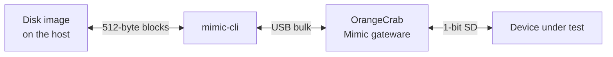

# Mimic

Mimic presents a host disk image to a device under test as an SD card. An
OrangeCrab implements the SD card and keeps a block cache. A host runtime moves
blocks between the FPGA and the image over USB.



The current reference setup uses an OrangeCrab r0.2 with an ECP5 25F. It can
boot the Nix Vegas Badge V2 from a host disk image. A hardware run with three
blocks of read-ahead reached the NixOS serial login prompt. The FPGA is the
development implementation. A future dedicated Mimic ASIC can replace it
without changing the host-served storage model.

## Quick start

Build the runtime:

```
nix build .#mimic-rt -o result-runtime
```

Build and program the OrangeCrab bitstream:

```
nix build .#orangecrab-25f-bitstream -o result-bitstream
openFPGALoader -c dirtyJtag result-bitstream/MimicSoC.bit
```

Then serve an image:

```
sudo ./result-runtime/bin/mimic-cli probe
sudo ./result-runtime/bin/mimic-cli serve --read-ahead=3 --stats sdcard.img
```

The server opens the image read-write by default. Use `--ro` when the device
must not change it.

## Mimic versus an SD-card mux

A physical SD-card mux connects one real card to either a workstation or the
device under test. Mimic replaces the card with an FPGA and serves its blocks
from a file on the workstation.

| Need | Mimic | Physical SD-card mux |
| ---- | ----- | -------------------- |
| Change an image | Select or copy a host file. No card removal or rewrite cycle is needed. | Switch ownership to the workstation, write the card, then switch it back. |
| Observe storage traffic | The runtime reports requests, reads, writes, refusals, cache activity, and card events. | The mux only changes the electrical connection. Extra tools are needed to observe blocks. |
| Change service behavior | Host software can validate requests, use read-only mode, change cache policy, and serve generated data. | The real card firmware and behavior stay fixed. |
| Extend the tool | Most new image policies, statistics, automation, and fault-injection controls are host software changes. Protocol and timing changes can be added to the programmable gateware. | New behavior usually needs another instrument around the mux or a different physical card. |
| Reuse the test hardware | New FPGA gateware can emulate another storage device or protocol that fits the existing I/O and electrical limits. The board and host link do not have to change. | The mux still connects a physical SD card. A different device type needs different test hardware. |
| Limit media wear | Reads and writes use a host image and FPGA RAM. Repeated image writes do not consume the program and erase life of a real SD card. | Every preparation and DUT write cycle uses the real card flash. |
| Control system cost | One Mimic link replaces the physical card, mux, and separate card-writing workflow. Its total cost depends on the implementation and production volume. | A mux needs switching hardware and a real card. Commercial tools can also need control and analysis hardware. |
| Accelerate repeated reads | The FPGA cache can answer a block without a USB round trip. Software-controlled read-ahead can fill more lines. | The real card uses its own controller and internal cache. |
| Match normal SD behavior | Mimic implements the supported part of the protocol and adds host-service latency. | A real card gives native command timing, transfer modes, and compatibility. |
| Protect ownership | The image service and DUT intentionally work together through the Mimic protocol. Do not mount or modify the image from another process while it is served. | The switch gives the workstation or DUT exclusive electrical ownership. This reduces contention and concurrent file-system access. |

Use Mimic when the disk image is part of a test system. It removes manual card
swaps, keeps writes in a normal host file, and makes the block service visible
to software. Its register probes, capacity tools, write protection, counters,
and programmable cache are useful for repeatable bring-up and fault tests. The
same FPGA and USB hardware can host a different compatible device model later,
and repeated development writes do not wear a physical SD card.

Mimic is also a hardware-hacking instrument. Its runtime shows request and
block counts, transferred bytes, refused requests, dropped writes, cache hits
and misses, read-ahead fills, card-busy drops, and model resets. These counters
help connect a UART or JTAG failure to the storage traffic that caused it. A
hacker can then change the image service or FPGA model and repeat the test with
the same wiring.

Mimic is designed as the stronger general hardware-hacking platform. When a
test needs a new policy, statistic, image source, automation hook, or fault
mode, it can usually be added to the host runtime. A missing SD command or
electrical behavior can be added to the programmable device model. The planned
ASIC will move the proved data path into dedicated hardware while the host tool
remains the extensible control plane.

## Repository layout

| Path | Contents |
| ---- | -------- |
| `ip/` | The Dart and ROHD gateware, the generator, and gateware tests. |
| `runtime/` | The Zig host library and `mimic-cli`. |
| `pcb/` | The KiCad hardware design for the dedicated Mimic board. |
| `pkgs/` | The Nix packages for the generator, runtime, and PCB outputs. |
| `devices.nix` | The FPGA and PDK build target declarations. |
| `docs/` | Architecture, hardware, operation, and diagnostic notes. |

## Documentation

- [docs/README.md](docs/README.md) gives the documentation index.
- [docs/architecture.md](docs/architecture.md) describes the data path and
  clock domains.
- [docs/hardware.md](docs/hardware.md) gives the OrangeCrab pin map and setup.
- [docs/bring-up.md](docs/bring-up.md) gives the build, program, and boot flow.
- [docs/runtime.md](docs/runtime.md) describes `mimic-cli` and disk images.
- [docs/registers.md](docs/registers.md) gives the CSR and request formats.
- [docs/debugging.md](docs/debugging.md) gives a fault isolation sequence.
- [docs/status.md](docs/status.md) records tested functions and limitations.

## License

Software, gateware, and documentation are licensed under Apache-2.0. See
[LICENSE](LICENSE). Hardware design files under `pcb/` are licensed separately
under CERN-OHL v1.2. See [pcb/LICENSE](pcb/LICENSE).
