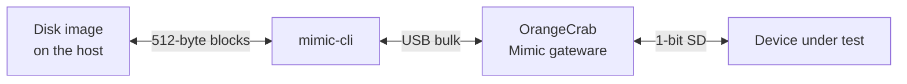

# Mimic

Mimic presents a host disk image to a device under test as an SD card. An
OrangeCrab implements the SD card and keeps a block cache. A host runtime moves
blocks between the FPGA and the image over USB.



The current reference setup uses an OrangeCrab r0.2 with an ECP5 25F. It can
boot the Nix Vegas Badge V2 from a host disk image. Read-ahead is under active
bring-up and must stay off for reliable boots.

## Quick start

Build the runtime:

```
nix build .#mimic-rt -o result-runtime
```

Build and program the OrangeCrab bitstream:

```
nix build .#orangecrab-25f-bitstream -o result-bitstream
openFPGALoader -c dirtyJtag result-bitstream/MimicSoC.bit
```

Then serve an image:

```
sudo ./result-runtime/bin/mimic-cli probe
sudo ./result-runtime/bin/mimic-cli serve --read-ahead=0 --stats sdcard.img
```

The server opens the image read-write by default. Use `--ro` when the device
must not change it.

## Repository layout

| Path | Contents |
| ---- | -------- |
| `ip/` | The Dart and ROHD gateware, the generator, and gateware tests. |
| `runtime/` | The Zig host library and `mimic-cli`. |
| `pkgs/` | The Nix packages for the generator and runtime. |
| `devices.nix` | The FPGA and PDK build target declarations. |
| `docs/` | Architecture, hardware, operation, and diagnostic notes. |

## Documentation

- [docs/README.md](docs/README.md) gives the documentation index.
- [docs/architecture.md](docs/architecture.md) describes the data path and
  clock domains.
- [docs/hardware.md](docs/hardware.md) gives the OrangeCrab pin map and setup.
- [docs/bring-up.md](docs/bring-up.md) gives the build, program, and boot flow.
- [docs/runtime.md](docs/runtime.md) describes `mimic-cli` and disk images.
- [docs/registers.md](docs/registers.md) gives the CSR and request formats.
- [docs/debugging.md](docs/debugging.md) gives a fault isolation sequence.
- [docs/status.md](docs/status.md) records tested functions and limitations.

## License

Apache-2.0. See [LICENSE](LICENSE).
