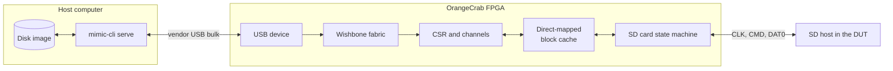

# Architecture

Mimic has two active parts. The FPGA acts as an SD card. The host runtime
backs that card with a disk image.



## Read path

1. The device under test sends an SD read command.
2. The card checks its direct-mapped block cache.
3. A cache hit goes directly to the SD host.
4. A cache miss posts a two-word request in the request channel.
5. The runtime reads the requested block from the disk image.
6. The runtime returns a sequence tag and 128 words through `DATA_IN`.
7. The card accepts a matching block, updates the cache, and sends the block
   on DAT0.

The sequence tag prevents a late block from answering a newer request. Tag 0
is reserved for a speculative cache fill.

## Write path

1. The card receives one block from the SD host.
2. The card checks its CRC16 and puts the words in `DATA_OUT`.
3. The card posts a write or discard request.
4. The runtime removes all 128 words and writes valid data to the image.
5. The runtime writes `WRITE_ACK` with the request tag.
6. The card releases DAT0 busy after the acknowledgement.

A write invalidates the cache line for that block. The runtime uses
write-through operation. The SD host does not get a successful completion
until the image write completes.

## Cache and read-ahead

Each cache line holds one 512-byte block. The default build has 128 lines,
which use 64 KiB for data. Low address bits select a line. The full block
address forms the tag.

The runtime owns the fill policy. A fill sends `DATA_FILL_LBA`, tag 0, and one
block through `DATA_IN`. A later read can then complete without a USB round
trip. The gateware supplies hit, miss, and completed-fill counters.

Read-ahead is not reliable on the reference hardware yet. Use
`--read-ahead=0` until [status.md](status.md) states that it is safe.

## Control path

The OrangeCrab enumerates as USB vendor device `1209:10c1`. Endpoint 1 OUT
takes register commands. Endpoint 1 IN returns reads. The USB bridge is the
only Wishbone master. The SD control block is the only Wishbone slave, at
base address `0x00000000`.

The command header is seven little-endian bytes:

```
opcode:u8, address:u32, length:u16
```

The protocol has write, read, and fixed-address stream operations. The stream
operation moves many words through one FIFO register.

## Clock and reset domains

The Wishbone and USB logic run at 48 MHz from an FPGA PLL. The PLL lock holds
the system in reset until the clock is stable. Full-speed USB requires this
48 MHz rate.

The device under test supplies the SD clock. This clock can stop at any time.
The SD logic therefore has a separate asynchronous domain. Handshakes, gray
counters, and synchronized state signals cross between the SD and system
domains. The OrangeCrab uses an ECP5 `DCCA` global buffer for the SD clock.

`reset_n` is active low. SD CMD0 also clears card state and invalidates the
block cache.
